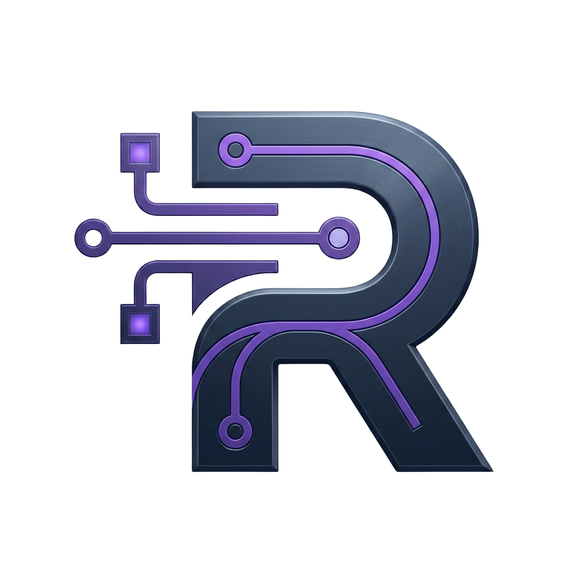
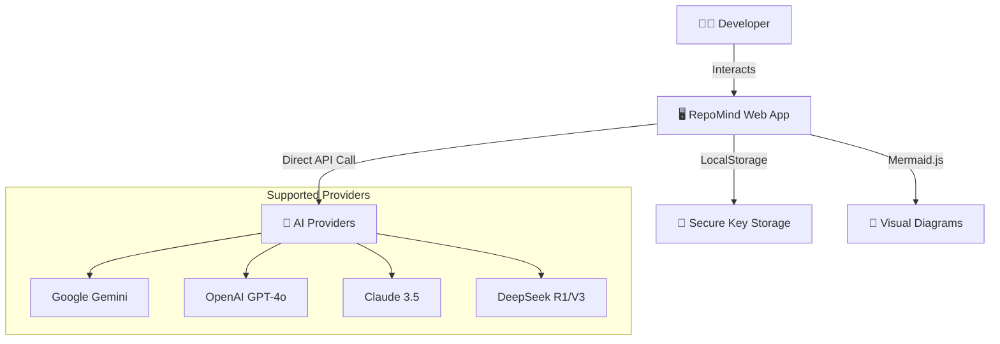

<div align="center">
  
  <h1>✨ RepoMind</h1>
  <p><strong>The Ultimate AI-Powered Code Intelligence Hub</strong></p>

  <p>
    <a href="https://temrevil.github.io/RepoMind/"></a>
    <a href="https://nextjs.org"></a>
    <a href="https://www.typescriptlang.org"></a>
    <a href="https://tailwindcss.com"></a>
  </p>
</div>

---

## 🚀 Overview

**RepoMind** is an advanced AI coding assistant that lives where your code does. It provides a seamless interface to analyze repository structures, debug complex logic, and generate real-time architecture diagrams using state-of-the-art LLMs.

Designed for performance and privacy, RepoMind runs entirely in your browser, connecting directly to your preferred AI providers.

### 🌟 Key Features

| Feature | Description |
| :--- | :--- |
| **🧠 Multi-Model Intelligence** | Connect to **Gemini 2.0/Thinking**, **GPT-4o**, **Claude 3.5**, and **DeepSeek R1** via direct API calls. |
| **🎨 Design Mode** | Instantly generate **Mermaid.js** architecture diagrams by chatting with your code. |
| **📂 Context-Aware Analysis** | Deep integration with your Local Files and GitHub Repositories. |
| **🔒 Zero-Server Architecture** | Your API keys never leave your browser. Privacy is baked into the core. |
| **⚡ Ultra-Responsive UI** | Built with Framer Motion for 60fps animations and a premium glassmorphic feel. |

---

## 🏗️ Architecture

RepoMind is a pure static frontend application deployed via GitHub Actions.



---

## 🛠️ Getting Started

### Prerequisites
- **Node.js** (v20+)
- **npm**

### Installation

1.  **Clone the repository**
    ```bash
    git clone https://github.com/TemRevil/RepoMind.git
    cd RepoMind
    ```

2.  **Install dependencies**
    ```bash
    npm install
    ```

3.  **Run locally**
    ```bash
    npm run dev
    ```

4.  **Deployment**
    The project is configured for auto-deployment via GitHub Actions. Simply push to the `main` branch.

---

## 🤝 Collaboration & Contributing

We ❤️ contributions! Whether you're fixing a bug, adding a provider, or improving the UI, your help is welcome.

### How to contribute:
1. **Fork** the repository.
2. **Create a branch** for your feature: `git checkout -b feature/amazing-logic`.
3. **Commit** your changes: `git commit -m 'Add some feature'`.
4. **Push** to the branch: `git push origin feature/amazing-logic`.
5. **Open a Pull Request**.

### Development Guidelines:
- Keep the UI **premium and glassmorphic**.
- Use **Tailwind CSS v4** for styling.
- Ensure all AI calls remain **client-side** for privacy.

---

<div align="center">
  <sub>Built with ❤️ by TemRevil</sub>
</div>
