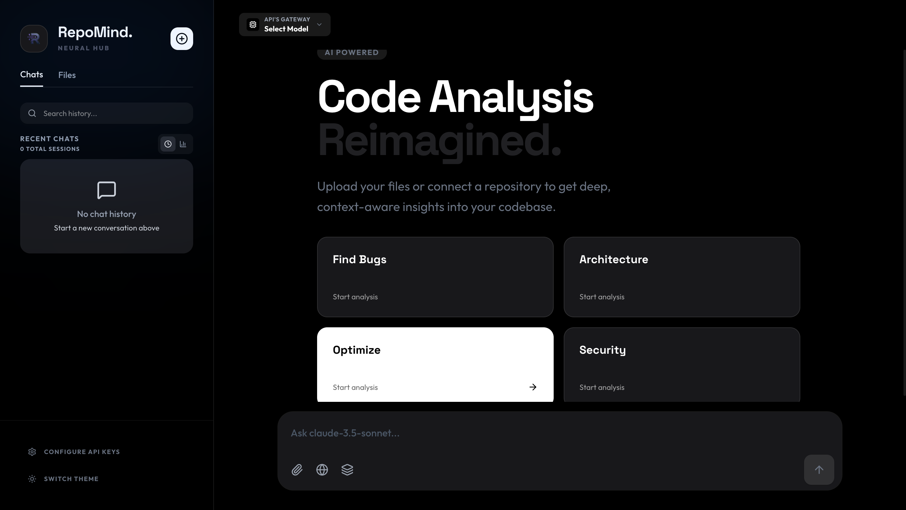
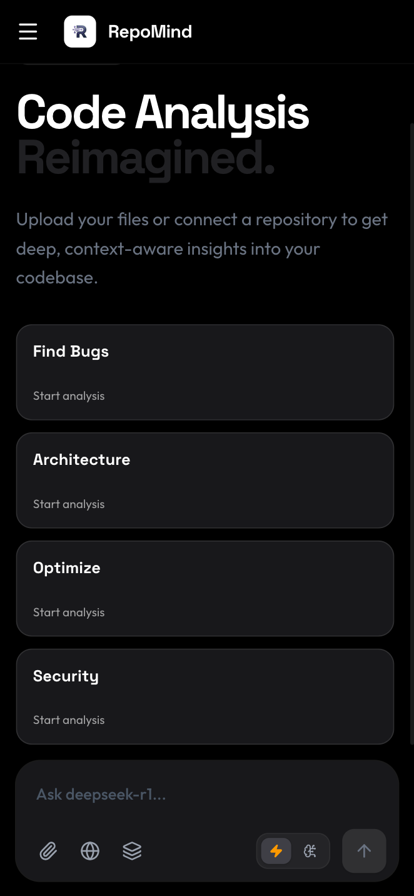
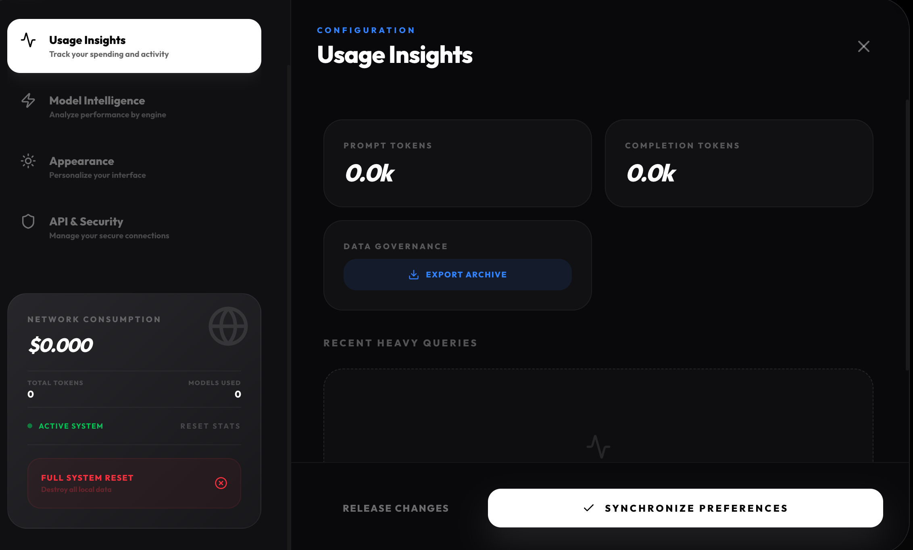
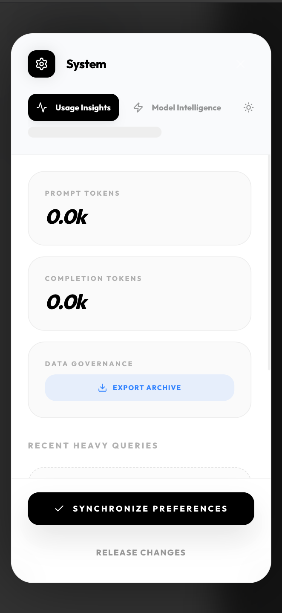
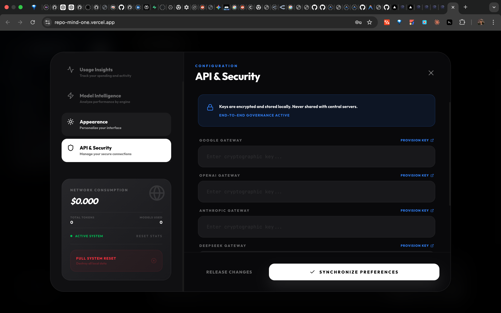
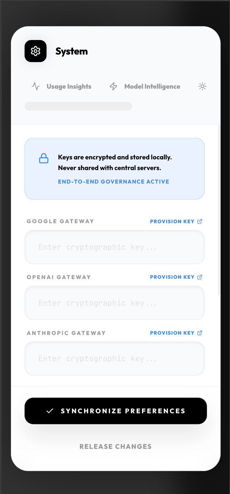
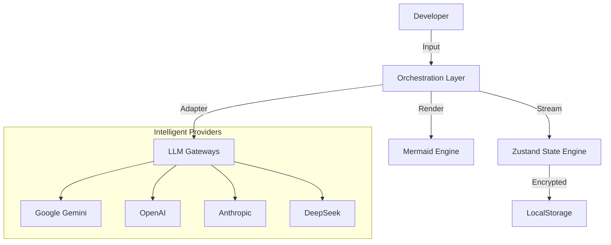

<div align="center">
  
  <h1>RepoMind</h1>
  <p><strong>Advanced Code Intelligence & Repository Orchestration</strong></p>

  <p>
    <a href="https://repo-mind-one.vercel.app/">
      
    </a>
  </p>

  <p>
    
    
    
    
  </p>
</div>

---

## Technical Overview

**RepoMind** is a state-of-the-art repository intelligence engine designed for developers who require deep, context-aware analysis of complex codebases. Unlike traditional AI wrappers, RepoMind leverages a **Multi-Track Orchestration Engine** to handle simultaneous reasoning and generation, providing real-time architectural insights and automated diagramming.

### Core Capabilities

- **Unified LLM Adapter**: Direct, secure integration with Gemini 2.0 (Thinking), GPT-4o, Claude 3.5+, and DeepSeek R1.
- **Architectural Visualization**: Automated Mermaid.js diagram generation via natural language requests.
- **Data Sovereignty**: Zero-server architecture ensures API keys and repository data never leave the client environment.
- **Performance Optimized**: 60fps glassmorphic UI driven by Framer Motion and TanStack Virtualization.

---

## Interface Showcase

<div align="center">
  <h3>Neural Hub (Desktop)</h3>
  
  <br/><br/>
  <table>
    <tr>
      <td align="center"><b>Mobile Dashboard</b></td>
      <td align="center"><b>Mobile Sidebar</b></td>
    </tr>
    <tr>
      <td></td>
      <td></td>
    </tr>
  </table>
  <br/>
  <table>
    <tr>
      <td align="center"><b>Usage Insights (Dark)</b></td>
      <td align="center"><b>Usage Insights (Light)</b></td>
    </tr>
    <tr>
      <td></td>
      <td></td>
    </tr>
  </table>
  <br/>
  <table>
    <tr>
      <td align="center"><b>API & Security (Dark)</b></td>
      <td align="center"><b>API & Security (Light)</b></td>
    </tr>
    <tr>
      <td></td>
      <td></td>
    </tr>
  </table>
</div>

---

## Tech Stack

| Layer | Technology |
| :--- | :--- |
| **Frontend** | React 19, Next.js 16, TypeScript 5 |
| **Styling** | Tailwind CSS v4, Framer Motion |
| **State** | Zustand, TanStack Query |
| **Graphics** | Mermaid.js, Lucide Icons |
| **Infrastructure** | Vercel (Production), GitHub Actions (CI/CD) |

---

## Architecture Design

RepoMind implements a robust, event-driven architecture that prioritizes user safety and interaction speed.



Detailed technical specifications can be found in [docs/ARCHITECTURE.md](docs/ARCHITECTURE.md).

---

## Getting Started

### Installation

1. **Clone the repository**
   ```bash
   git clone https://github.com/majdjadalhaq/RepoMind.git
   cd RepoMind
   ```

2. **Initialize Environment**
   ```bash
   npm install
   ```

3. **Development Server**
   ```bash
   npm run dev
   ```

4. **Production Build**
   ```bash
   npm run build
   ```

---

## Resilience & Quality

- **Error Boundaries**: Global crash recovery with persistent state preservation.
- **Accessibility**: WAI-ARIA compliant components with keyboard-first navigation.
- **Responsive Design**: Fluid layouts optimized for ultra-wide monitors and mobile devices.

---

## Contributing

We maintain strict quality gates for contributions. Please ensure:
- **TypeScript**: No `any` types allowed.
- **Performance**: No layout thrashing or unnecessary re-renders.
- **Security**: Client-side logic only; no server-side key handling.

See [CONTRIBUTING.md](CONTRIBUTING.md) for full guidelines.

---

<div align="center">
  <sub>Developed for the next generation of code intelligence.</sub>
</div>
